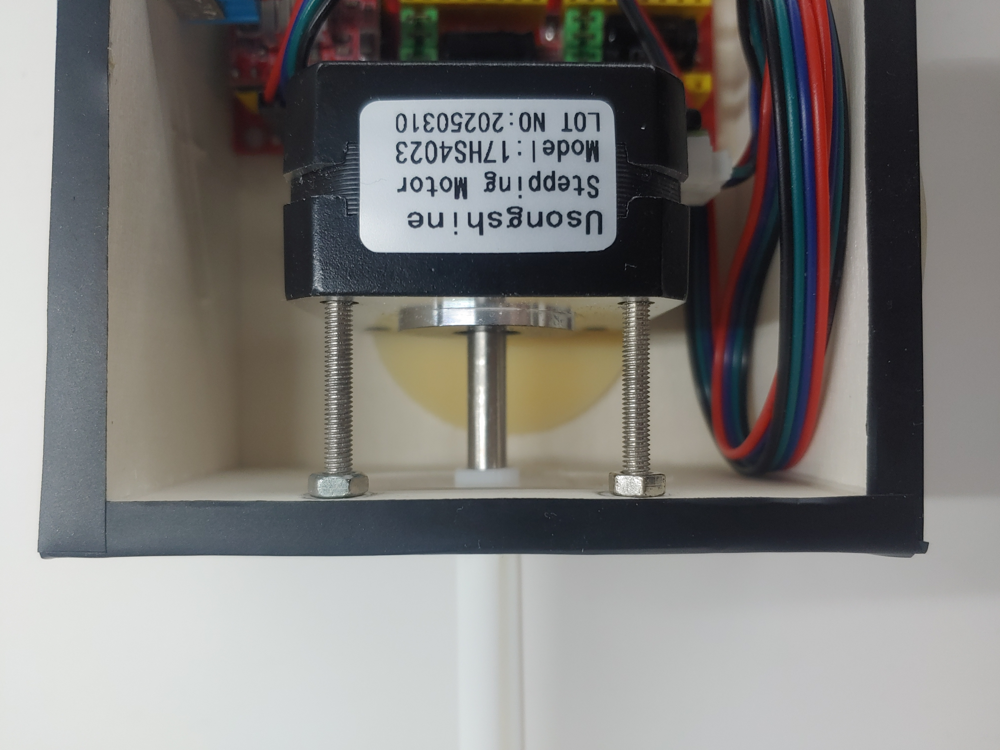
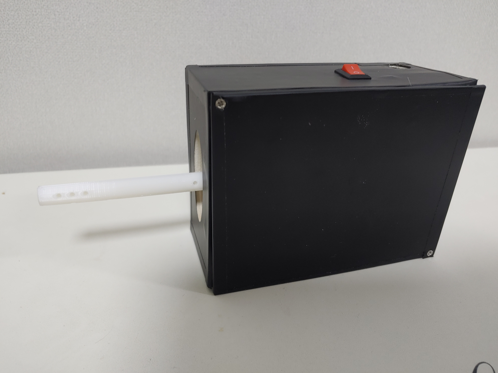
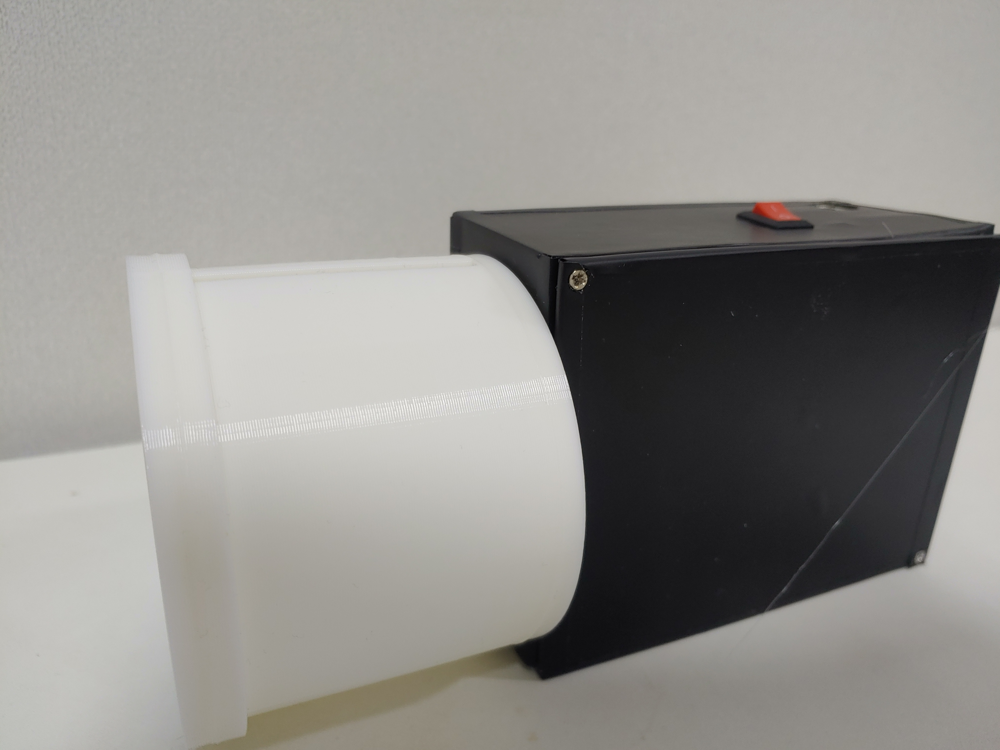
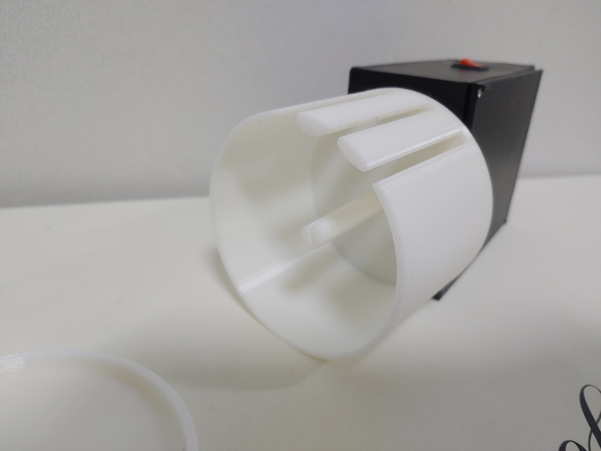
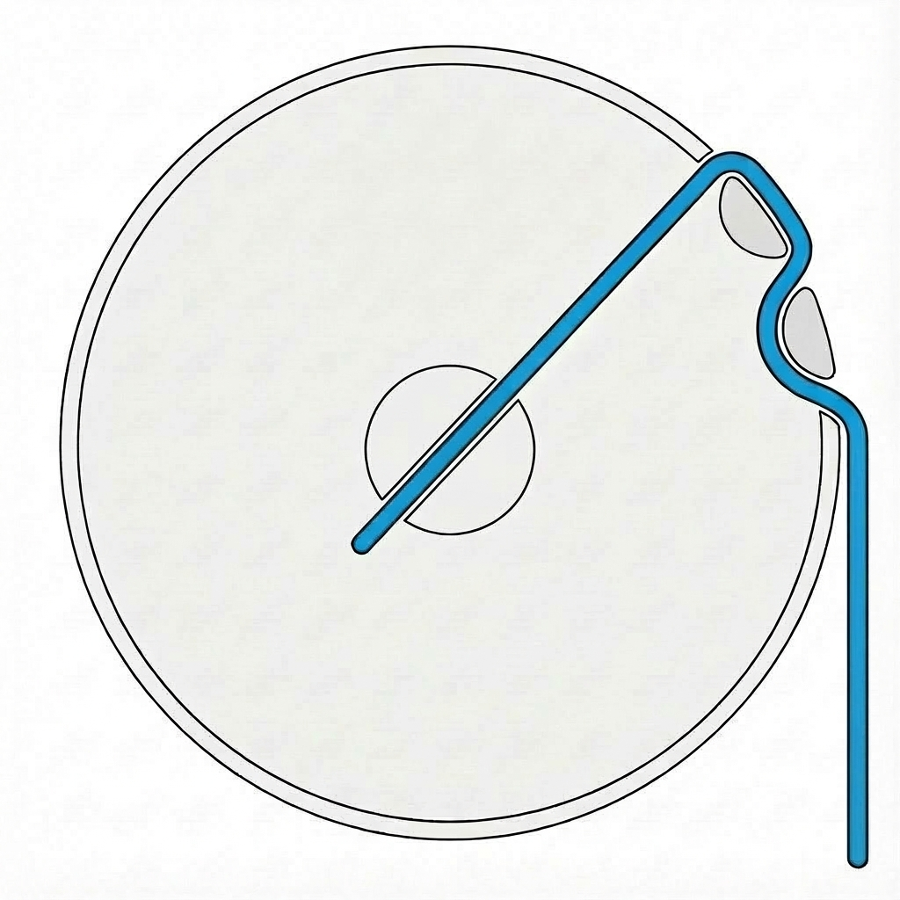

# Automatic Handwrap Roller v1
복싱·킥복싱 등  격투기에서 사용하는 핸드랩을 자동으로 말아주는 전동 롤러

## 1. 개요 
Automatic Handwrap Roller는 복싱, 킥복싱, MMA 등 격투기에서 사용하는 핸드랩을 자동으로 말아주는 장치이다. 


사용자가 핸드랩을 장치에 고정한 뒤 버튼을 누르면 자동으로 핸드랩을 말 수 있다. 
## 2. 구현
### 2.1. 사용부품 

||부품명|수량|
|---:|:-----------:|----:|
|1|Arduino Nano| x1|
|2|Arduino Nano CNC Shield v4| x1|
|3|NEMA17 17HS4023(Stepper Motor)|x1|
|4|A4988(Stepper Motor Driver)|x1|
|5|KCD11-2P2(Switch)| x1|
|6|M3 접시머리 볼트 30mm|x2|
|7|M3 너트|x2|
|8|12V 2A 어뎁터| x1|
|9|포멕스 3T| x1|


#### 부품 선정 이유


모터는 **Stepper Motor(17HS4023)** 를 사용하였다. 초기 테스트 단계에서는 저렴한 가격을 고려하여 노란색 기어드 DC 모터를 적용하였으나, 토크와 회전 속도가 부족하여 핸드랩이 감길수록 부하 증가로 인해 속도가 감소하고 구동 중 정지하는 문제가 발생하였다.
문제 해결을 위해 3D 프린터에서 많이 사용하는 NEMA17 시리즈, 그중 17HS4023 모델을 최종적으로 선택하였다. 저렴한 가격에도 필요한 회전 속도와 토크를 확보할 수 있다는 장점이 있어 선정하였다.

제어 보드는 **Arduino Nano**와 **Arduino Nano CNC Shield V4**를 사용하였다. CNC Shield V4를 사용하면 A4988 드라이버와 스테퍼 모터를 쉽게 연결할 수 있고, 12V 단일 전원으로 스테퍼 모터와 Arduino Nano 모두에 전원을 공급할 수 있어 회로 구성이 간결하다는 장점이 있어 선정하였다.

마지막으로 포멕스는 보드와 모터를 넣을 케이스를 만들기 위해 사용하였다. 포멕스 대신 다른 재료(목재, 아크릴 등등)를 사용해도 무방하다. M3볼트와 너트는 아래 사진처럼 모터의 Shaft길이만큼 모터를 뒤로 이동시키기 위해 사용하였다. 



### 2.2. 제작방법 
#### 2.1.1. 하드웨어 결선
하드웨어는 아래와 같은 방법으로 연결한다.


#### 2.1.2. 3D 프린터 부품 출력 
<strong>'3d_part/'</strong> 폴더에 있는 3개의 파일을 출력한다.
|부품명|수량|
|-----|---|
|Body| x1|
|Cover| x1|
|Shaft| x1|   


#### 2.1.3. 소스코드 
Arduino IDE에서 <strong style="color:blue">'src/automaticHandwrapRoller.ino'</strong> 파일을 열고 상단 메뉴의 Tools 에서 아래와 같이 설정한다.
|항목|값|
|-----|---|
|Board|Arduino Nano|
|Processor | ATmega328P|


만약 old bootloader를 사용하는 경우 Processor 를 ATmega328P (Old Bootloader)를 선택하여 업로드하면 된다. 

다음으로 소스코드에서 
```ino
/*automaticHandwarpRoller.ino */
#define DIR   2 
#define STEP  5
#define EN    8
```

해당 define 으로 설정된 부분은 X축 기준으로 설정된 것이므로 Y 나 Z 축 부분에 연결하려 한다면 아래 참고자료의 'Arduino Nano CNC Shield v4 schematic' 을 보고 DIR과 STEP의 값을 수정하면 된다. 

```c
/*
  ㄱ. X
    EN    - D8(공통)
    DIR   - D2
    STEP  - D5

  ㄴ. Y
    EN    - D8(공통)
    DIR   - D3
    STEP  - D6

  ㄷ. Z
    EN    - D8(공통)
    DIR   - D4
    STEP  - D7
*/
```

## 3. 완성 모습



## 4. 사용법
1. Body의 홈에 Shaft가 들어가도록 본체에 연결한다.

2. 사용 후 건조한 핸드랩을 Shaft에 끼운다. 
3. 아래 사진처럼 되도록 핸드랩을 정리한다. 



4. Cover를 닫고 스위치를 눌러 핸드랩을 감는다.
5. 핸드랩이 다 말렸다면 스위치를 끈다. 
6. Body를 분리한 후 Cover를 열고 핸드랩을 꺼낸다.


### 시연 영상


<video controls src="img/video.mp4" title="Title"></video>


## 참고 자료
|항목|주소|
|--|--|
|Arduino Nano CNC Shield v4 schematic| https://www.instructables.com/How-to-Use-the-CNC-V4-Board-despite-Its-quirks/|
